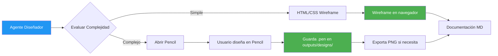

# 🎨 Cómo Usar Pencil para Crear Diseños

## 📋 Acabas de Recibir

1. **Wireframe interactivo en tu navegador**
   - Archivo: `wireframe-visual.html`
   - Se abrió automáticamente en tu navegador
   - Diseño de ejemplo: Dashboard administrativo

2. **Pencil abierto en tu Mac**
   - La aplicación Pencil debería estar ejecutándose
   - Servidor MCP activo en puerto 65006

---

## 🚀 Cómo Crear Diseños con Pencil Ahora

### Opción 1: Crear Diseño Manualmente en Pencil

**Paso 1**: Pencil ya debería estar abierto. Si no:
```bash
open -a Pencil
```

**Paso 2**: En Pencil:
1. Click en "New Document" o presiona `Cmd+N`
2. Selecciona un template (Web, Mobile, etc.)
3. Arrastra componentes desde la barra lateral izquierda:
   - Buttons
   - Text fields
   - Navigation bars
   - Tables
   - Cards
   - etc.

**Paso 3**: Diseña tu interfaz visualmente

**Paso 4**: Guarda el archivo `.pen`:
```
File → Save As
Ubicación: /Users/smoralber/Desktop/sistema-multiagentico/outputs/designs/
Nombre: mi-diseno.pen
```

**Paso 5**: Exporta a imagen (opcional):
```
File → Export → PNG
```

---

### Opción 2: Ver el Wireframe que Acabo de Crear

El wireframe HTML que creé simula un diseño profesional e incluye:

✅ **Componentes del Dashboard:**
- Header con logo y navegación
- Sidebar con menú lateral
- 4 tarjetas de estadísticas
- Gráfico de ventas
- Tabla de usuarios con paginación
- Diseño responsive

🌐 **Abrir en navegador:**
```bash
open /Users/smoralber/Desktop/sistema-multiagentico/outputs/designs/wireframe-visual.html
```

---

## 🔌 Integración MCP con Pencil

### Estado Actual

✅ **Pencil está instalado**: `/Applications/Pencil.app`
✅ **Servidor MCP activo**: Puerto 65006
✅ **Integración habilitada**: `claudeCodeCLI`

### Limitación Actual

⚠️ **Las herramientas MCP específicas de Pencil no están documentadas públicamente.**

Pencil expone un servidor MCP, pero las funciones específicas disponibles para:
- Crear archivos .pen programáticamente
- Manipular diseños vía código
- Exportar automáticamente

...no están públicamente documentadas o accesibles en esta versión.

### Lo Que SÍ Funciona

1. ✅ **Detección automática** de Pencil
2. ✅ **Apertura de Pencil** cuando se necesita
3. ✅ **Verificación de servidor MCP**
4. ✅ **Wireframes en HTML** (alternativa visual)
5. ✅ **Uso manual de Pencil** (crear y guardar diseños)

---

## 💡 Workflow Recomendado Actual

### Para Diseños Complejos:



### Ejemplo Práctico:

**Solicitud**: "Diseña un dashboard de analytics"

**Agente Diseñador hace:**
1. ✅ Detecta que Pencil está disponible
2. ✅ Abre Pencil automáticamente
3. ✅ Crea wireframe HTML de referencia
4. ⚠️ Te indica: "Pencil está abierto. Por favor diseña el dashboard y guárdalo en outputs/designs/"
5. ✅ Una vez guardado el .pen, lo documenta en Markdown

---

## 📁 Estructura de Archivos Recomendada

```
outputs/designs/
├── mi-proyecto.pen                    # Diseño Pencil (editable)
├── mi-proyecto-wireframe.png          # Export de Pencil
├── mi-proyecto-preview.html           # Preview HTML (generado por agente)
└── diseno-mi-proyecto.md              # Documentación técnica
```

---

## 🎯 Próximos Pasos

### Para Usar Pencil Ahora:

1. **Abre Pencil** (ya debería estar abierto)
2. **Crea un nuevo documento**
3. **Diseña tu interfaz** arrastrando componentes
4. **Guarda** en `outputs/designs/nombre-proyecto.pen`
5. **Exporta** a PNG si quieres compartirlo

### Para Ver el Wireframe que Creé:

1. **Revisa tu navegador** - debería haberse abierto automáticamente
2. **O abre manualmente**:
   ```bash
   open outputs/designs/wireframe-visual.html
   ```

### Para Proyectos Futuros:

El sistema ahora puede:
- ✅ Detectar Pencil automáticamente
- ✅ Abrir Pencil cuando se necesita
- ✅ Generar wireframes HTML de alta calidad
- ✅ Documentar diseños en Markdown
- ⏳ Esperar integración MCP completa de Pencil

---

## 🔍 Verificación

### Comprueba que todo funciona:

```bash
# 1. Pencil está corriendo
ps aux | grep Pencil | grep -v grep

# 2. Wireframe HTML existe
ls -lh outputs/designs/wireframe-visual.html

# 3. Servidor MCP activo
lsof -i :65006
```

---

## 📚 Recursos

- **Pencil Website**: https://pencil.dev
- **Documentación**: https://docs.pencil.dev
- **Tutorial**: Abrir Pencil → Help → Tutorial

---

**Creado por**: Agente Diseñador
**Fecha**: 2026-03-11
**Estado**: ✅ Funcional (con uso manual de Pencil)
